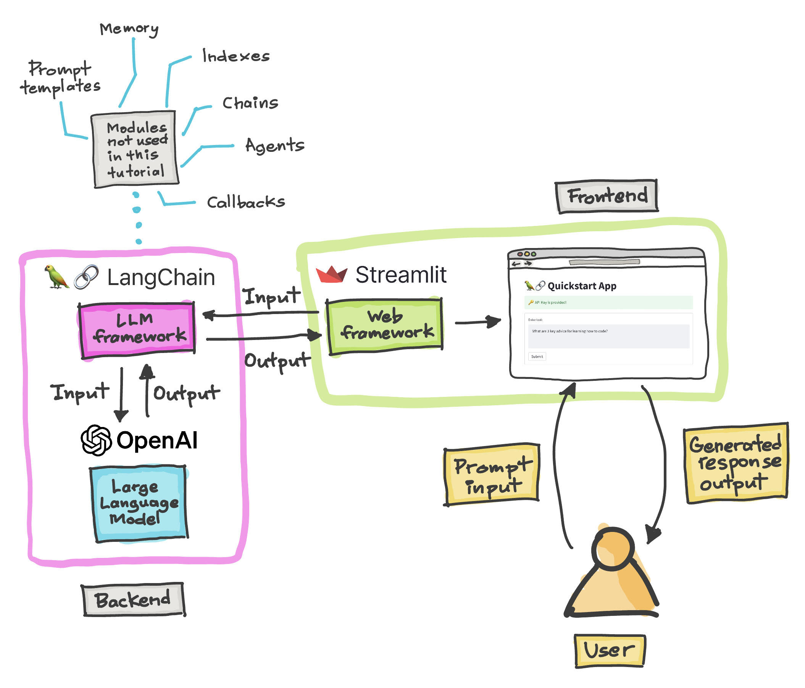

# 🦜🔗 Timeless Love - Streamlit Frontend

Build your first LLM powered family memory app with Langchain and Streamlit.

## Overview of the App

- Accepts memory descriptions (e.g. `Tell me about my daughter's first birthday party`) as prompt input using Streamlit's `st.text_area()`, then assign this to the `memory_description` variable.
- LLM model is called via `llm()` and it is applied on the prompt input `memory_description` to generate enriched and detailed narratives via `llm(memory_description)`

## Demo App

## Get an OpenAI API key

To enhance the storytelling of your family memories, follow these steps to get your own OpenAI API key:
1. Visit [OpenAI Platform](https://platform.openai.com/account/api-keys).
2. Click on the `+ Create new secret key` button.
3. Enter an identifier name (optional) and click on the `Create secret key` button.

## Try out the app

Once the app is loaded, enter your OpenAI API key and type a memory description into the text box. Wait for the LLM to generate a beautifully crafted narrative of your family memory.

This customized version reflects the essence of Timeless Love, focusing on family memories and leveraging LLM technology to bring those memories to life in a more detailed and narrative manner.
